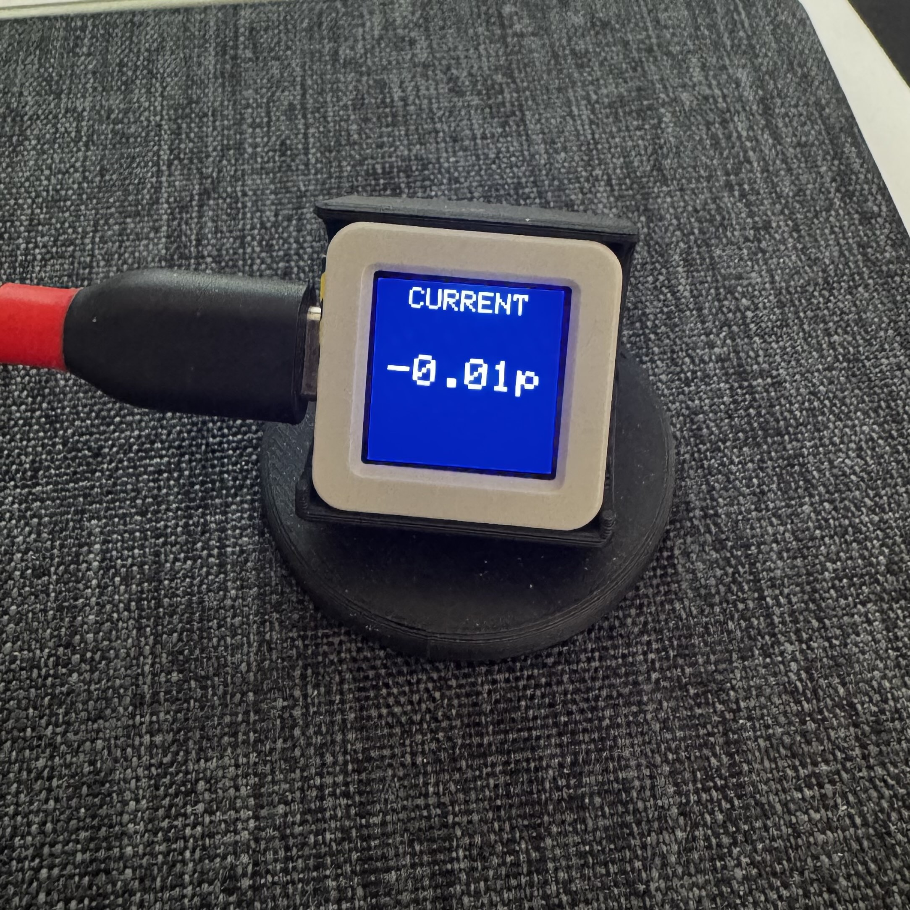
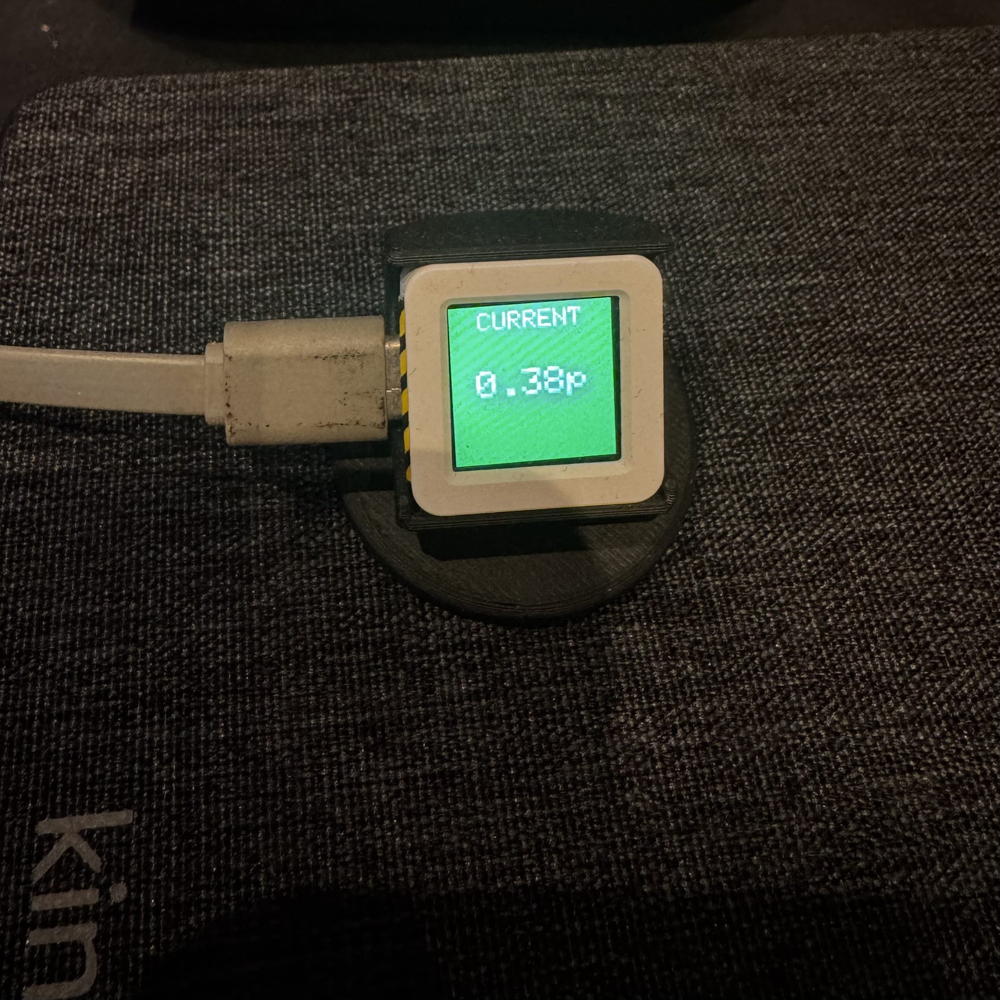
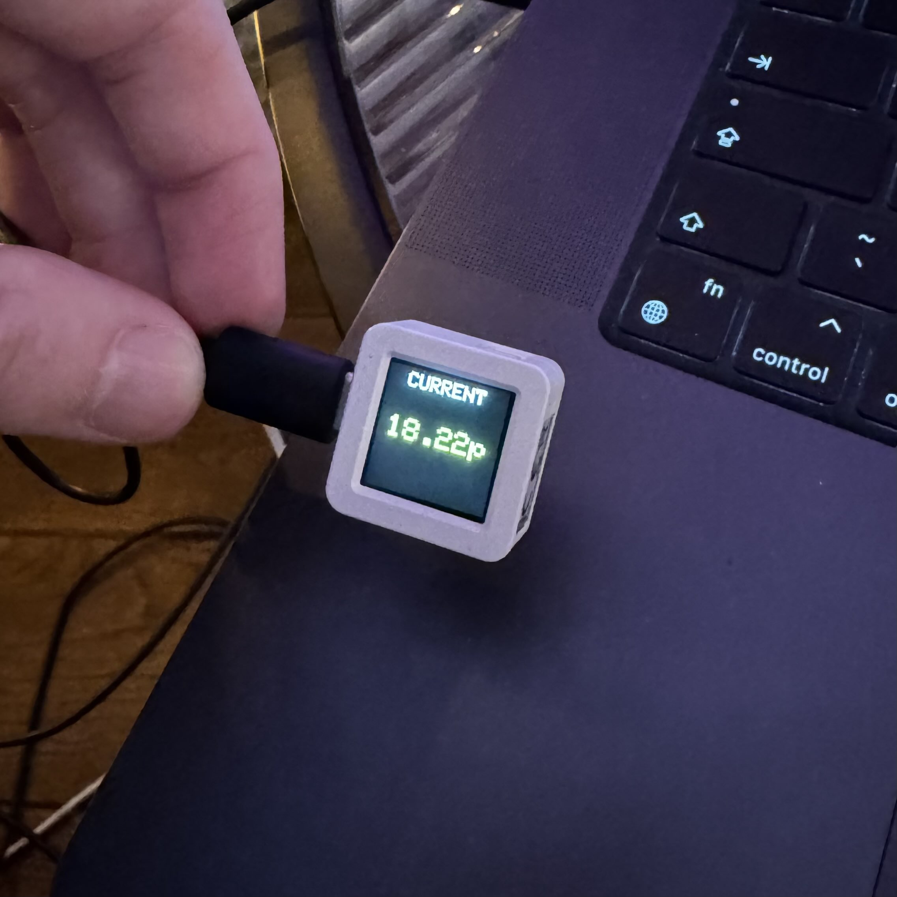
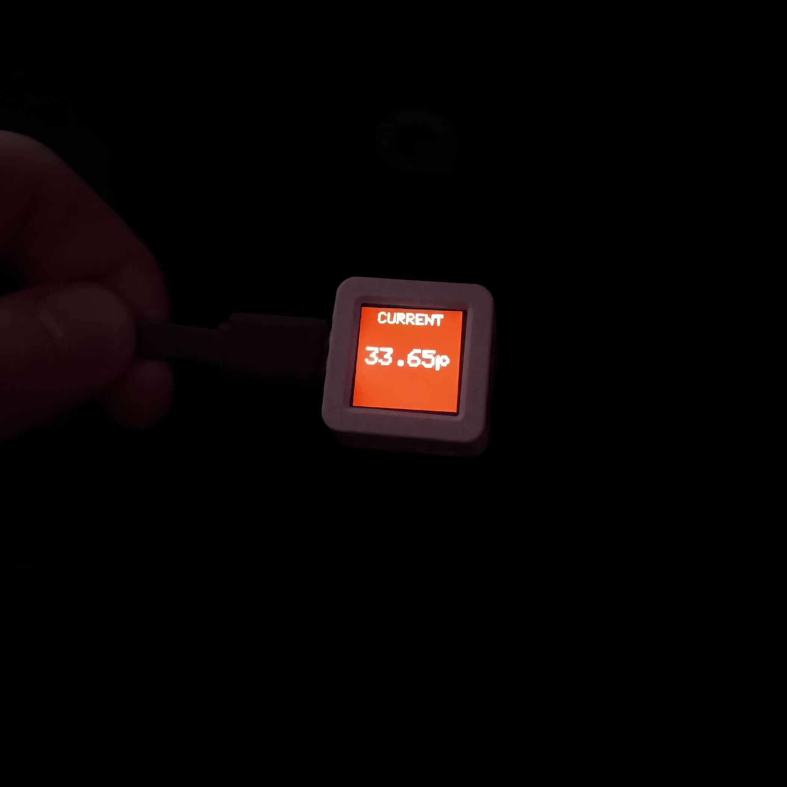

# OctopusRates-M5AtomS3

## Description
A simple project to use an M5-AtomS3 (an ESP-32 based Microcontroller) to fetch the latest [Octopus Agile](https://octopus.energy/smart/agile/) pricing (a dynamic electricity pricing plan from Octopus Energy).

Displays the current price on screen as it changes throughout the day, including colours to clearly indicate much cheaper than normal electricity, and also a warning indicator for when the current price is greater than the standard unit rate for the standard fixed rate.

Included in the models folder is a simple stand to hold the screen at a 45° angle, for easy readability placed on a table or shelf. Included is the exported model file, but also the original Autodesk Fusion project.


## Usage
- Set WIFI details in secrets.h
``` cpp
    #define SECRET_WIFI_SSID "";
    #define SECRET_WIFI_PASSWORD "";
```
- Double check Agile endpoint and ensure the DNO region set is correct, it is currently set to E for Midlands - See comment at URL definition in main.ino

### Colour Coding
- 🔵 Blue — negative/plunge pricing
- 🟢 Green — below 10p/kWh
- 🟡 Yellow — 10-24p/kWh - Black background as this is the 'normal' state
- 🔴 Red — above 24p/kWh

### Images

#### Device display states
| Blue (plunge) | Green (cheap) |
| --- | --- |
|  |  |

| Yellow (normal) | Red (peak) |
| --- | --- |
|  |  |

#### Stand model


## References
- [Microcontroller](https://docs.m5stack.com/en/core/AtomS3)
- [Octopus API](https://docs.octopus.energy/rest/guides/endpoints/#api-price-endpoints)

### Arduino Libraries
- [M5GFX](https://github.com/m5stack/M5GFX)
- [ArduinoJson](https://github.com/bblanchon/ArduinoJson)


## Future work
- ~~Add images to repository.~~
- ~~3D printed stand model~~.
- Use screen button press to have a second 'page' showing daily average.
- Use onboard LED either RGB values to show current price state OR to show when fetching and processing rate information.
